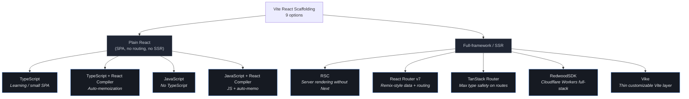
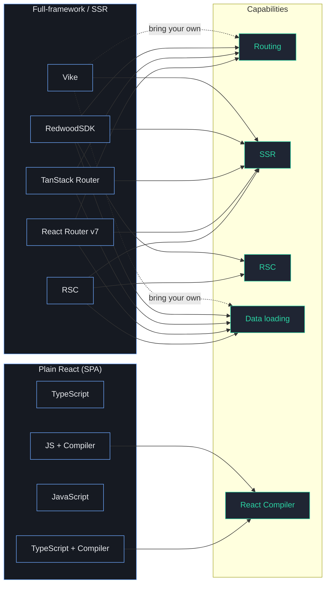
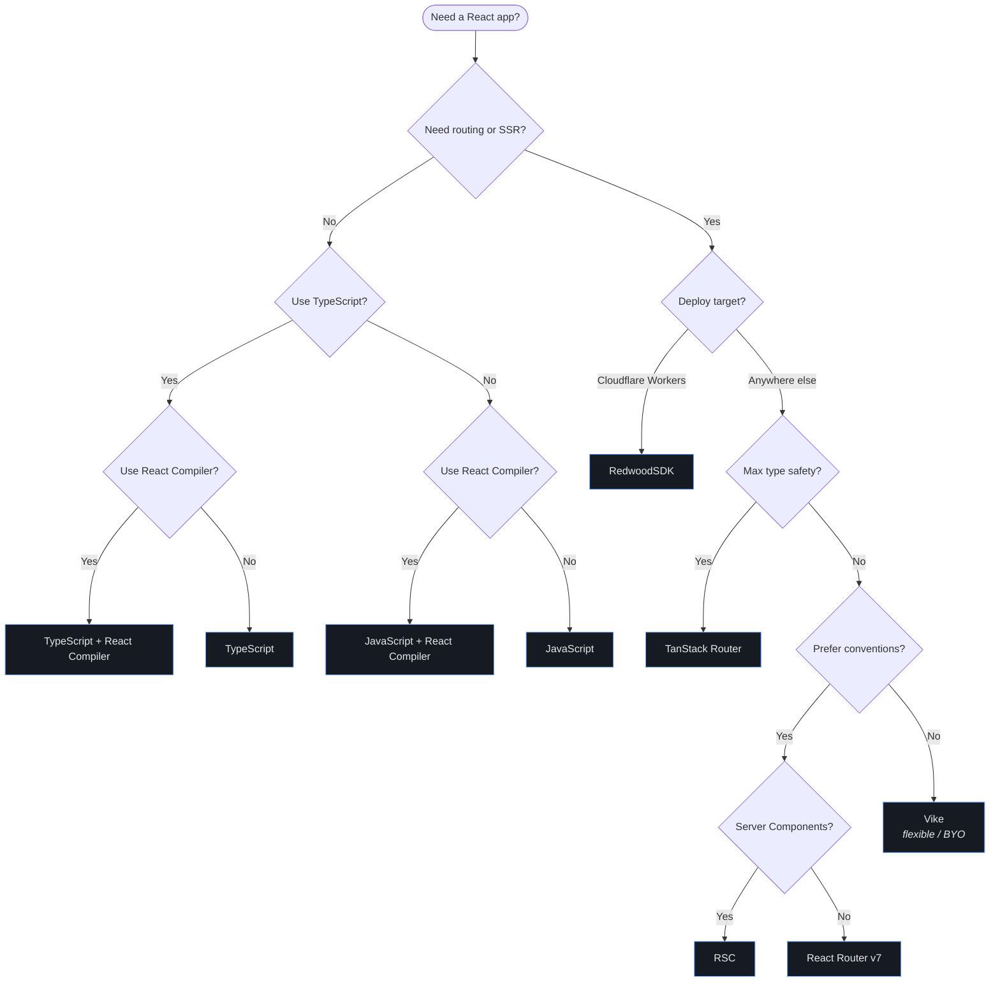

# Vite React Scaffolding — Mermaid Diagrams

Renders in GitHub, VS Code (with Mermaid extension), Obsidian, and any other Mermaid-aware viewer.

## Hierarchy

## Capability matrix

Grouped by which features each option turns on.

## Decision flow

